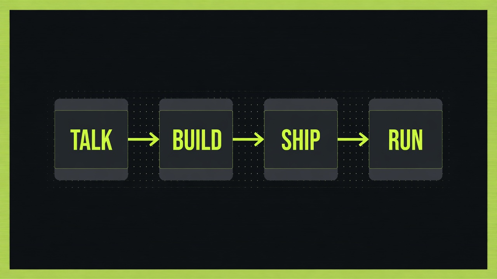
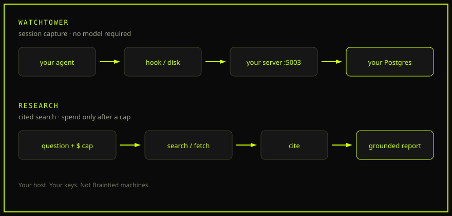

<h1>We build AI so you can be human.</h1>

<p><em>People create in conversation. Agents build and ship.</em></p>

<sub>Los Angeles · <a href="https://www.braintied.com">braintied.com</a></sub>

<p>
  
</p>

| Beat | What happens |
|------|----------------|
| **Talk** | People decide in a room. The system hears the ask and drafts the plan. |
| **Build** | Agents write the product. Humans review. |
| **Ship** | Live URLs, real Stripe, days not quarters. |
| **Run** | CRM, meetings, marketing, finance, and intelligence come with the company. |

The loop ran on air on 16 July 2026. A meeting on Kulti Meet. A landing page shipped during the show. [kulti.live](https://kulti.live)

## The north star

Hunger. Housing. Clean water. Renewable energy.

That is the work the money is for.

## Companies on the engine

| Company | What it is |
|---------|------------|
| [Silver Dollar](https://www.sd4me.com) | Family asset platform. Live. |
| [CoCoach](https://co-coach.app) | AI co-coach for football clubs. Live about six days after the fork. |
| [GuardNIL U](https://www.guardnilu.com) | Development platform for youth athletes and their families. |

## Open source

Two pieces of the engine are public.

<p>
  
</p>

### Watchtower

Records what coding agents tried, which of those attempts failed, and the error that came back.

It does not call a model. If the tool writes a session, Watchtower can store it.

Default webhook is `http://localhost:5003/webhooks/session`. The hook refuses `ora-watchtower.fly.dev`.

```bash
git clone https://github.com/braintied/watchtower.git
cd watchtower && npm install && docker compose up --build
```

[README](https://github.com/braintied/watchtower/blob/main/README.md) · [AGENTS.md](https://github.com/braintied/watchtower/blob/main/AGENTS.md)

### Research

You name the question and a dollar cap. It searches, fetches, cites, and grounds every claim against the fetched page.

Search and fetch can run at $0 (SearXNG, Crawl4AI). Synthesis needs a model key you supply. A missing vendor key disables that lane. It does not swap in another.

```bash
pnpm add @braintied/research
```

The host passes credentials in. The package never reads `process.env`.

[README](https://github.com/braintied/research/blob/main/README.md) · [AGENTS.md](https://github.com/braintied/research/blob/main/AGENTS.md)

Also public: [agentlog](https://github.com/braintied/agentlog), [kimi-router](https://github.com/braintied/kimi-router).

## Hire the engine

[Consulting](https://www.braintied.com/consulting) · [Studio](https://www.braintied.com/studio) · [hello@braintied.com](mailto:hello@braintied.com)
